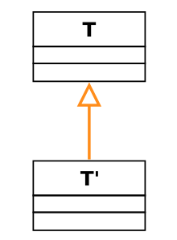
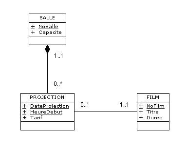

# UML

UML signifie Unified Modeling Language.  Il ne s'agit pas d'un langage de programmation, mais plutôt d'une méthode de modélisation.

## Introduction au concept d’objet en informatique

Un objet est créé par le développeur pour l’utiliser et le faire et utiliser par d‘autres.

Un objet représente une entité du monde réel ou virtuel.

Un objet va être déifni par **une identitée** (nom, numéro), **son état** à un instant t (la représentation des valeurs de ses attributs) et par son **comportement** (l’ensemble des opérations possibles sur l’objet).

Une **classe** est une asbtraction d’un ensemble d’objets qui possèdent une structure identique.

*Exemple :* La classe Écran possède les attributs Marque, Résolution, Taille, Couleur et les méthodes Allumer(), Éteindre(), ModifierRésolution() et l’objet MonÉcran possède les attributs Dell, 17"…

En UML on désigne l’objet par la nomenclature : Nomdelaclasse:Nomdel'objet ou bien :Nomdel’objet.

Principe d’encapsulation

### Association et agrégation

**L’association** est la relation perçue entre des classes d’objets. Exemple : classes Salarié et Entreprise.

**L’agrégation** est  la relation entre une classe et un ensemble d’une autre classe. Exemple : classes Commande et LigneCommande. Autre exemple : une université est composée de plusieurs facultés, et chaque faculté est un agrégat de plusieurs professeurs. La destruction de l'université implique la destruction des facultés qui la composent, alors que la destruction d'une faculté n'implique pas la destruction des professeurs liés à cette faculté par une relation d'agrégation.

### Généralisation / Spécialisation

La **généralisation** consiste à rassembler les éléments communs à plusieurs classes au sein d’une surclasse parent dont hériteront les classes filles.

La **spécialisation** consiste à créer à partir d’une classe commune de sous-classes pouvant chacune avoir ses propres spécificités.

### Polymorphisme

Capacité donnée à une opération de s’exécuter différemment en fonction de la classe où elle se trouve.

### Persistance

La **persistance** est la capacité d’une propriété à garder sa valeur après l’exécution du programme.

### Classes d’interface

Mise à disposition à d’autres classes d’un ensemble d’opération.

## Conventions UML

### Représentation d’une classe

### Nomenclature des attributs

- « + » : public, accessible à tous
- « # » : protégé, accessible à la classe et à ses sous-classes
- « - » : privé, accessible à l’intérieur de la classe uniquement

### Relations

**Multiplicité** : nombre d’occurrences possibles de l’association entre les classes.

- « * » : de 0 à l’infini
- « x...y » : minimum x, maximum y
- « 1...* » : de 1 à l’infini
- « x,y » : soit x soit y

